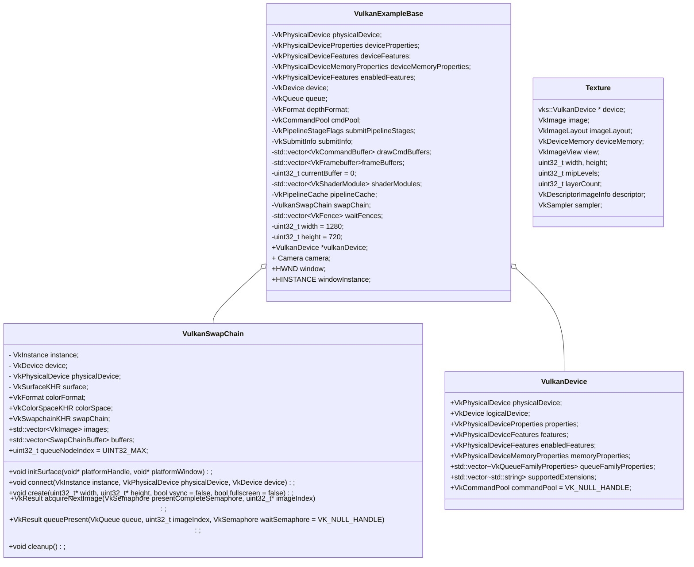

## 框架详解

[TOC]


#### 类图



#### 流程

```c++
int main
{
    // 处理commandline, console等信息
    vulkanExample = new VulkanExample();
    
    vulkanExample->initVulkan();
    {
        VkResult VulkanExampleBase::createInstance(bool enableValidation);
        {
            // 获取支持的Extension
         	// 获取已经启用的Extension
            //校验层设置
         
            //创建VkInstance
            vkCreateInstance(&instanceCreateInfo, nullptr, &instance);
        }
        
        // 获取GPU，封装为VkPhysicalDevice，使用第一个作为程序使用的VkPhysicalDevice
        std::vector<VkPhysicalDevice> physicalDevices(gpuCount);
        err = vkEnumeratePhysicalDevices(instance, &gpuCount, physicalDevices.data());
        physicalDevice = physicalDevices[selectedDevice];
        
        // 
        vulkanDevice = new vks::VulkanDevice(physicalDevice);
        {
            // 获取GPU的属性，限制，内存信息等等

            // 获取队列簇属性
            
            // 获取支持的扩展
        }
        
        // 创建逻辑设备
        VkResult res = vulkanDevice->createLogicalDevice(enabledFeatures, enabledDeviceExtensions, deviceCreatepNextChain);
        {
            // 填写VkDeviceQueueCreateInfo结构体，指定要创建的队列类型和其他信息
            
            // 添加使用swapChain的扩展
            
            // 创建VkDevice，逻辑设备
            VkResult result = vkCreateDevice(physicalDevice, &deviceCreateInfo, nullptr, &logicalDevice);
            //创建默认的commandPool
            commandPool = createCommandPool(queueFamilyIndices.graphics);
        }
        
            // Get a graphics queue from the device
        vkGetDeviceQueue(device, vulkanDevice->queueFamilyIndices.graphics, 0, &queue);

        // Find a suitable depth format
        VkBool32 validDepthFormat = vks::tools::getSupportedDepthFormat(physicalDevice, &depthFormat); 
        
        // 获取创建swapChain扩展的方法指针
        swapChain.connect(instance, physicalDevice, device);
        
        // 异步处理
        // 提交处理
    }
    
    // 创建window
    HWND VulkanExampleBase::setupWindow(HINSTANCE hinstance, WNDPROC wndproc);
    
    void VulkanExample::prepare()
    {
        VulkanExampleBase::prepare();
        {
            void VulkanExampleBase::initSwapchain()
            {
                void VulkanSwapChain::initSurface(void* platformHandle, void* platformWindow)
                {
                    // 根据窗口信息创建Surface
                    vkCreateWin32SurfaceKHR(instance, &surfaceCreateInfo, nullptr, &surface);
                    
                    // 获取支持present的queue
                    // 设置colorFormat和ColorSpace
                }
            }
            
            void VulkanExampleBase::createCommandPool();
         
            void VulkanExampleBase::setupSwapChain()
            {
                swapChain.create(&width, &height, settings.vsync, settings.fullscreen);
                {
                    // 获取surface的的属性和格式
                    // 获取支持presentMode
                    // 获取surface的宽高
                    
                    // 填充VkSwapchainCreateInfoKHR结构体
                    // 创建Swapchain
                	VK_CHECK_RESULT(fpCreateSwapchainKHR(device, &swapchainCI, nullptr, &swapChain));
                    
                    // 获取vkImage数量
                    // 创建vkImageView
                }
            }
            
            // Create one command buffer for each swap chain image and reuse for rendering
            // 为swapChain中的每一个image创建一个command buffer
            void VulkanExampleBase::createCommandBuffers();
            
            // 为cpu与gpu同步创建fence
            void VulkanExampleBase::createSynchronizationPrimitives();
            
            void VulkanExampleBase::setupDepthStencil();
            {
                // 创建depthStencil的image、mem、以及ImageView
            }
            //创建RenderPass
            void VulkanExampleBase::setupRenderPass();
            
            //创建PipelineCache
            void VulkanExampleBase::createPipelineCache();
            
            // 为每个swapChain的Image创建一个FrameBuffer
            void VulkanExampleBase::setupFrameBuffer()；
        }
        
        
    }
}
```

## Vulkan概念

### VkInstance

初始化Vulkan library， 为驱动程序提供应用层信息

#### 创建

```cpp
VkApplicationInfo; // 提供应用信息
VkInstanceCreateInfo; // 提供扩展和校验层信息
vkCreateInstance(&createInfo, nullptr, &instance);
```

#### 销毁

```cpp
vkDestroyInstance(instance, nullptr);
```

### VkPhysicalDevice

显卡的抽象

#### 获取方式

```c++
uint32_t deviceCount = 0;
vkEnumeratePhysicalDevices(instance, &deviceCount, nullptr);
std::vector<VkPhysicalDevice> devices(deviceCount);
vkEnumeratePhysicalDevices(instance, &deviceCount, devices.data());
```

#### 设备评估

```c++
// name， type, vulkan版本
VkPhysicalDeviceProperties deviceProperties;
vkGetPhysicalDeviceProperties(device, &deviceProperties);
//支持的特性，如纹理压缩，64位浮点数和多视图渲染， geometryshader
VkPhysicalDeviceFeatures deviceFeatures;
vkGetPhysicalDeviceFeatures(device, &deviceFeatures);
```

#### 选择设备

选择支持特性最多的那个设备

### Queue Family队列族

支持不同的command的队列, VkQueueFamilyProperties结构体包含具体信息

#### 获取显卡支持的队列族

```c++
VkQueueFamilyProperties;//支持的command类型，以及支持的队列数
    
uint32_t queueFamilyCount = 0;
vkGetPhysicalDeviceQueueFamilyProperties(device, &queueFamilyCount, nullptr);
std::vector<VkQueueFamilyProperties> queueFamilies(queueFamilyCount);
vkGetPhysicalDeviceQueueFamilyProperties(device, &queueFamilyCount, queueFamilies.data());
```

### VkDevice

用于与物理设备交互的逻辑设备。

#### 创建

```c++
VkDeviceQueueCreateInfo; //包括队列类型，队列数量，以及队列的优先级
VkDeviceCreateInfo; // 需要指定创建的队列info以及使用的物理设备的特性，扩展和校验层
//需要physicalDevice
vkCreateDevice(physicalDevice, &createInfo, nullptr, &device)
```

#### 销毁

```cpp
vkDestroyDevice(device, nullptr);
```

### VkQueue

存储command的队列，创建VkDevice时创建

#### 检索/获取

```c++
vkGetDeviceQueue(device, indices.graphicsFamily, 0, &graphicsQueue);
```

### Vulkan Window Surface/ VkSurfaceKHR

用以呈现渲染图像使用, surface是Vulkan与窗体系统的连接桥梁

#### 创建

需要在`instance`创建之后立即创建窗体`surface`，它会影响物理设备的选择

```c++

VkWin32SurfaceCreateInfoKHR; // 包含窗口和进行的句柄

VkSurfaceKHR surface;

auto CreateWin32SurfaceKHR = (PFN_vkCreateWin32SurfaceKHR) vkGetInstanceProcAddr(instance, "vkCreateWin32SurfaceKHR");
CreateWin32SurfaceKHR(instance, &createInfo, nullptr, &surface) 
```

直接使用glfw创建

```cpp
glfwCreateWindowSurface(instance, window, nullptr, &surface)
```

#### 销毁

```cpp
vkDestroySurfaceKHR(instance, surface, nullptr);
```


### VkSwapchainKHR 

从屏幕的角度观察，交换链本质上是一个图像队列。一个图像在后台渲染，一个图形在前台显示。

#### 创建

1. 检查物理设备的扩展是否支持交换链
2. 查询交换链支持详情
   - surface的功能属性（最大最小数量，宽高）
   - 格式和颜色空间
   - presentMode
     - 三重缓冲，队列模式

```c++
// surface
// image count
// color format, Color space
// 分辨率
// 不同队列族之间的交换链图形如何处理
VkSwapchainCreateInfoKHR; 

VkSwapchainKHR swapChain;
vkCreateSwapchainKHR(device, &createInfo, nullptr, &swapChain) ;
```

### VkImage和VkImageView

使用任何的**VkImage**，包括在交换链或者渲染管线中的，我们都需要创建**VkImageView**对象。从字面上理解它就是一个针对图像的视图或容器，通过它具体的渲染管线才能够读写渲染数据，换句话说`VkImage`不能与渲染管线进行交互。

#### 创建

```c++
// vkImage的指针
// 图像的使用目标
// 
VkImageViewCreateInfo;
vkCreateImageView(device, &createInfo, nullptr, &swapChainImageViews[i]);
```

#### 销毁

```cpp
 vkDestroyImageView(device, swapChainImageViews[i], nullptr);
```

### RenderPass

指定frame buffer帧缓冲附件相关信息，需要指定多少个颜色和深度缓冲会被使用，指定有多少个采样器会被使用，整个渲染操作过程中的相关内容应该如何处理 

附件、子通道

#### 创建

```c++
VkRenderPass renderPass;

vkCreateRenderPass(device, &renderPassInfo, nullptr, &renderPass)
```

#### 销毁

```c++
vkDestroyRenderPass(device, renderPass, nullptr);
```

### vulkan帧缓冲区

为在swapChain中所有的Image对象创建frame buffer,以便呈现

#### 创建

```c++
std::vector<VkFramebuffer> swapChainFramebuffers;

VkFramebufferCreateInfo; // imageview,renderpass, 宽高
vkCreateFramebuffer(device, &framebufferInfo, nullptr, &swapChainFramebuffers[i]);
```

#### 销毁

```cpp
vkDestroyFramebuffer(device, swapChainFramebuffers[i], nullptr);
```

### Vulkan 命令缓冲区

在命令缓冲区对象中记录我们期望的任何操作，例如绘制和内存相关命令。利于多线程优化

#### 命令池command pool

管理用于存储缓冲区的内存，并从中分配命令缓冲区

#### 创建

```cpp
VkCommandPoolCreateInfo; // 队列族， flag
vkCreateCommandPool(device, &poolInfo, nullptr, &commandPool)
```

#### 销毁

```cpp
vkDestroyCommandPool(device, commandPool, nullptr);
```

#### 命令缓冲区

```cpp
//为交换链中的每一个image创建一个command buffer
std::vector<VkCommandBuffer> commandBuffers;
VkCommandBufferAllocateInfo;//commandbuffer数量和cmdpool
vkAllocateCommandBuffers(device, &allocInfo, commandBuffers.data()) ;
```

#### 开始记录

```cpp
VkCommandBufferBeginInfo;
vkBeginCommandBuffer(commandBuffers[i], &beginInfo);
```

启动Renderpass

```cpp
VkRenderPassBeginInfo;
vkCmdBeginRenderPass(commandBuffers[i], &renderPassInfo, VK_SUBPASS_CONTENTS_INLINE);
```

基本绘图命令

```cpp
// 绑定图形管线
vkCmdBindPipeline(commandBuffers[i], VK_PIPELINE_BIND_POINT_GRAPHICS, graphicsPipeline);

vkCmdDraw(commandBuffers[i], 3, 1, 0, 0);
```

结束渲染

```cpp
vkCmdEndRenderPass(commandBuffers[i]);
vkEndCommandBuffer(commandBuffers[i]);
```
