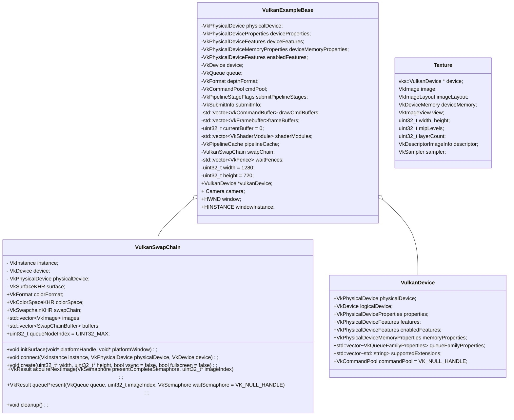

## 框架详解

#### 类图



#### 流程

```c++
int main
{
    // 处理commandline, console等信息
    vulkanExample = new VulkanExample();
    
    vulkanExample->initVulkan();
    {
        VkResult VulkanExampleBase::createInstance(bool enableValidation);
        {
            // 获取支持的Extension
         	// 获取已经启用的Extension
            //校验层设置
         
            //创建VkInstance
            vkCreateInstance(&instanceCreateInfo, nullptr, &instance);
        }
        
        // 获取GPU，封装为VkPhysicalDevice，使用第一个作为程序使用的VkPhysicalDevice
        std::vector<VkPhysicalDevice> physicalDevices(gpuCount);
        err = vkEnumeratePhysicalDevices(instance, &gpuCount, physicalDevices.data());
        physicalDevice = physicalDevices[selectedDevice];
        
        // 
        vulkanDevice = new vks::VulkanDevice(physicalDevice);
        {
            // 获取GPU的属性，限制，内存信息等等

            // 获取队列簇属性
            
            // 获取支持的扩展
        }
        
        // 创建逻辑设备
        VkResult res = vulkanDevice->createLogicalDevice(enabledFeatures, enabledDeviceExtensions, deviceCreatepNextChain);
        {
            // 填写VkDeviceQueueCreateInfo结构体，指定要创建的队列类型和其他信息
            
            // 添加使用swapChain的扩展
            
            // 创建VkDevice，逻辑设备
            VkResult result = vkCreateDevice(physicalDevice, &deviceCreateInfo, nullptr, &logicalDevice);
            //创建默认的commandPool
            commandPool = createCommandPool(queueFamilyIndices.graphics);
        }
        
            // Get a graphics queue from the device
        vkGetDeviceQueue(device, vulkanDevice->queueFamilyIndices.graphics, 0, &queue);

        // Find a suitable depth format
        VkBool32 validDepthFormat = vks::tools::getSupportedDepthFormat(physicalDevice, &depthFormat); 
        
        // 获取创建swapChain扩展的方法指针
        swapChain.connect(instance, physicalDevice, device);
        
        // 异步处理
        // 提交处理
    }
    
    // 创建window
    HWND VulkanExampleBase::setupWindow(HINSTANCE hinstance, WNDPROC wndproc);
    
    void VulkanExample::prepare()
    {
        VulkanExampleBase::prepare();
        {
            void VulkanExampleBase::initSwapchain()
            {
                void VulkanSwapChain::initSurface(void* platformHandle, void* platformWindow)
                {
                    // 根据窗口信息创建Surface
                    vkCreateWin32SurfaceKHR(instance, &surfaceCreateInfo, nullptr, &surface);
                    // 设置colorFormat和ColorSpace
                }
            }
            
            void VulkanExampleBase::createCommandPool();
         
            void VulkanExampleBase::setupSwapChain()
            {
                swapChain.create(&width, &height, settings.vsync, settings.fullscreen);
                {
                    // 获取surface的的属性和格式
                    // 获取支持presentMode
                    // 获取surface的宽高
                    
                    // 填充VkSwapchainCreateInfoKHR结构体
                    // 创建Swapchain
                	VK_CHECK_RESULT(fpCreateSwapchainKHR(device, &swapchainCI, nullptr, &swapChain));
                    
                    // 获取vkImage数量
                    // 创建vkImageView
                }
            }
            
            // Create one command buffer for each swap chain image and reuse for rendering
            void VulkanExampleBase::createCommandBuffers();
        }
    }
}
```

